# Felsefi Argüman Haritası

## Görsel Özet

```mermaid
graph TD
    root["bilinçin metafiziği: "]
    63d4f65c("Sağduyu Realizmi’ne Revizyonist İtiraz")
    80225624{"Kanıtçılık Reddi Bilmek = Kanıtlayabilme..."}
    9ef403f2("Delil/kanıt ölçütü belirsizliği itirazı")
    c487f4f7("Poppercı yanlışlanabilirlik: Gerekçelend...")
    c09ff6b1("Hakikat–bilgi karışıklığı itirazı doğrul...")
    4e696039{"Deskriptif Metafizik Savunması Truism’le..."}
    7e8300af("Truism’ler Kanıt Değil: Şüpheciliğe Karş...")
    94d70769("Revizyonist Metafiziği Peşinen Dışlama S...")
    90d4fe4d("Sağduyu Realizmi Tartışmalı Metafizik Ta...")
    9429aca2{"Zihin-Bağımsızlık ve Psikolojizm Reddi Ö..."}
    d5e9dc43("Şüphecilik: Kanıtlanamayan Bilgi Sorunu")
    670a150c{"Moorecu Sağduyu Ters Çevirme"}
    f42f8224("Kanıtlanabilirlik Şartı Olmadan “Ters Çe...")
    c50d85d8("Revizyonist Metafiziğin Meydan Okuması S...")
    f648b2ea("İdealist Alternatiflere Karşı Yetersiz S...")
    8772e2ef{"Şüpheciliği Şüpheciye Yöneltme Yükümlülü..."}
    350fb4c8("Döngüsellik Pryor/Wright tarzı şüpheci ç...")
    0f7f27b5("Dretske: Gerekçelendirme zorunlu değil y...")
    b1fbca83("Klein: Kapanış ilkesiyle yükümlülük ters...")
    9a6dc763{"Yanılabilircilik Fallibilizm İtirazı: Ke..."}
    1ac16f30("Sonucu Varsayma Begging the Question Ele...")
    2310aa4d("Eş Seslilik Equivocation: ‘Yapmalı’ Ahla...")
    30155522("Yanılmazcılık/Dışsalcılık: Bilgi İçin Ya...")
    8948defc("Otopoyeziz Eleştirisi: ‘Gerçeklik’ Varsa...")
    root --> 63d4f65c
    63d4f65c --> 80225624
    80225624 --> 9ef403f2
    80225624 --> c487f4f7
    80225624 --> c09ff6b1
    63d4f65c --> 4e696039
    4e696039 --> 7e8300af
    4e696039 --> 94d70769
    4e696039 --> 90d4fe4d
    63d4f65c --> 9429aca2
    root --> d5e9dc43
    d5e9dc43 --> 670a150c
    670a150c --> f42f8224
    670a150c --> c50d85d8
    670a150c --> f648b2ea
    d5e9dc43 --> 8772e2ef
    8772e2ef --> 350fb4c8
    8772e2ef --> 0f7f27b5
    8772e2ef --> b1fbca83
    d5e9dc43 --> 9a6dc763
    9a6dc763 --> 1ac16f30
    9a6dc763 --> 2310aa4d
    9a6dc763 --> 30155522
    root --> 8948defc
```

## Detaylı Akış

## 🌳 bilinçin metafiziği: 
_ROOT_ | Score: 1.0

Analitik Felsefe:Tümü
·
İyi Oluş & Hayatın Anlamı
·
Sosyal Bilimler
Farkındalık Problemi – Sahanika Ratnayake
Farkındalık her ne kadar kendisini nötr bir değer olarak tanıtsa da benlik ve evren hakkında (sorunlu) varsayımlarla dolu.

Ama yine de, böyle bir noktaya gelme yolunda her an çok fazla ilerleme kaydedebileceğimizi düşünmeye meyilliyim sanırım. Sürekli olarak ilerleyebilecek olsak bile, bilinç problemini tam anlamıyla çözüp çözemeyeceğimiz ise cevabını bilmediğim bir soru.”
Bilinç Ölçer ...

### 🔴 Sağduyu Realizmi’ne Revizyonist İtiraz
_OBJECTION_ | Score: 0.9

Moore’un deskriptif (tasvir edici) metafiziği, “açık doğruluklar”a (truisms) ve sağduyu inançlarının genellikle doğru olduğuna dayanır. Strawson’ın çerçevesindeki revizyonist metafizik ise tam tersine, varlığın doğasına dair bu sezgisel inançları köklü biçimde değiştirmeyi hedefleyebileceğinden, bilince dair sağduyu temelli bir metafiziğin metodunu ilkesel olarak yetersiz bulabilir.

#### 🟢 Kanıtçılık Reddi (Bilmek = Kanıtlayabilmek Değil)
_REBUTTAL_ | Score: 0.9

Metinde vurgulandığı gibi, rüyada olmadığımı kanıtlayamasam da bunu bilebilirim; dolayısıyla bilgi için “kanıtlayabilme” şartını reddedersek şüpheci/revizyonist itirazın dayandığı standart zayıflar. Bu çizgide Moore Dönüştürmesi’nin ortaya çıkardığı argümanı kabul etmek için daha fazla gerekçemiz olduğu söylenir.

##### 🔴 Delil/kanıt ölçütü belirsizliği itirazı
_OBJECTION_ | Score: 0.9

Metin, delilciliğin ikna edici olabilmesi için neyin “kanıt” sayılacağını açıklaması gerektiğini; ancak bunun kültürden kültüre değiştiğini ve bilimde bile tartışmalı olduğunu vurgular. Bu, “bilmek = kanıtlayabilmek değil” iddiasına karşı, asıl sorunun kanıtın kendisini reddetmek değil, kanıt ölçütünü netleştirmek olduğu eleştirisini destekler.

##### 🔴 Poppercı yanlışlanabilirlik: Gerekçelendirme kanıtlamak değildir
_OBJECTION_ | Score: 0.9

Popper’ın yanlışlamacılığı, inançların “kesin kanıtla” doğrulanmasını değil, yanlışlanabilir olmasını ve karşı-örnek yoksa gerekçelendirilmiş kalmasını öne çıkarır. Bu çerçevede, “bilmek kanıtlayabilmek değildir” tezi, delilciliğe itiraz ederken hedefi ıskalayabilir: Bilimsel/epistemik gerekçelendirme zaten çoğu zaman kanıtlama değil, yanlışlanmaya açıklık ve eleştirel test edilebilirlik üzerinden işler.

##### 🔴 Hakikat–bilgi karışıklığı itirazı (doğrulamacılığın motivasyonu)
_OBJECTION_ | Score: 0.9

Metin, doğrulama kriterinin (ve benzeri kanıt-merkezli yaklaşımların) motivasyonunu “hakikat = bilgi” karışıklığına bağlayıp bunun “korkunç bir kafa karışıklığı” olduğunu söyler. Buna göre, “bilmek = kanıtlayabilmek değil” argümanı, eğer kanıtçılığı bu karışıklık üzerinden hedef alıyorsa, eleştirinin doğru adresi kanıtçılık değil; hakikat ile bilginin (ve anlam ile doğrulama koşullarının) birbirine karıştırılmasıdır.

#### 🟢 Deskriptif Metafizik Savunması (Truism’leri Açıklama)
_REBUTTAL_ | Score: 0.9

Moore’un “sağduyu realizmi”, Strawson’ın “revizyonist metafizik” dediği, varlığa dair inançlarımızı kökten değiştirmeyi amaçlayan yaklaşıma karşı deskriptif/tasvir edici metafiziği savunur. Felsefenin görevi, hepimizin bildiği açık doğruluklara (truisms) meydan okumak değil, onları açıklamak ve muğlaklıklarını gidermektir.

##### 🔴 Truism’ler Kanıt Değil: Şüpheciliğe Karşı Yetersizlik
_OBJECTION_ | Score: 0.9

Metinde vurgulandığı gibi “inandırıcı nedenlere sahip olmak” ile “kanıtlayabilmek” farklıdır; deskriptif metafizik truism’leri başlangıç noktası alıp açıklamaya yönelse de, bu yaklaşım şüpheciye karşı (ör. rüyada olma ihtimali) aranan türden bir kanıt sunmadığı için ikna edici bulunmayabilir.

##### 🔴 Revizyonist Metafiziği Peşinen Dışlama (Soruya Yanıtı Başta Varsayma)
_OBJECTION_ | Score: 0.9

Strawson’ın “revizyonist metafizik” dediği, varlığın doğasına dair inançlarımızı köklü biçimde değiştirmeyi amaçlayan yaklaşım, deskriptif metafizikte “sağduyuya meydan okumamak” ilkesiyle baştan problemli ilan edilir; bu da, kişilerin var olmadığı gibi revizyonist iddiaları argümansal olarak tartışmak yerine metodolojik olarak dışlama eleştirisine açık bırakır.

##### 🔴 Sağduyu Realizmi Tartışmalı Metafizik Taahhütler Yükler
_OBJECTION_ | Score: 0.9

Metinde sağduyunun kabul ettiği nesnelerin (maddi varlıklar, kategoriler vb.) “zihinlerimize ya da düşüncelerimize bağımlı olmadan var” olduğu söylenir; ancak bu, truism’leri sadece tasvir etmekten daha güçlü bir realizm iddiasıdır ve idealizme karşı tartışmalı bir ontolojik yükümlülük (zihinden bağımsız varlık) getirdiği için eleştirilebilir.

#### 🟢 Zihin-Bağımsızlık ve Psikolojizm Reddi (Önermeler Zihinsel Değil)
_REBUTTAL_ | Score: 0.9

Metinde Moore’un, sağduyunun kabul ettiği nesnelerin (maddi varlıklar vb.) zihinlerimize/düşüncelerimize bağımlı olmadan var olduğunu savunduğu belirtilir; bu, revizyonist (ör. idealist) yeniden yorumlara karşı doğrudan bir realizm hattıdır. Ayrıca Moore, Frege’yle uyumlu biçimde psikolojizmi reddeder: düşünme eylemi ile düşünülen şey (önerme) ayrıdır; bu ayrım, “gerçekliği zihne indirgeme” türü revizyonist hamleleri sınırlar.

### 🔴 Şüphecilik: Kanıtlanamayan Bilgi Sorunu
_OBJECTION_ | Score: 0.9

Metinde vurgulandığı gibi “rüyada olmadığımı kanıtlayabilmem” ile “rüyada olmadığımı bilmem” ayrımı, bilince dair iddiaların kanıtlanabilirlik ölçütüne takılabileceğini gösterir. Eğer bilinç/metafizik iddiaları kanıt gerektiriyorsa şüpheci argüman güçlenir; kanıt gerektirmiyorsa da bu kez hangi gerekçeyle bilgi sayılacağı tartışmalı hale gelir.

#### 🟢 Moorecu Sağduyu Ters Çevirme
_REBUTTAL_ | Score: 0.9

Moore’un stratejisi, şüpheci hipotezi (rüya/BIV) çürütemediğimizi varsaymak yerine, daha makul görünen sağduyu bilgisini ("iki ayağımın üzerinde yürüdüğümü biliyorum") başlangıç alıp buradan rüya/BIV hipotezinin yanlış olduğunu çıkarsamaktır. Böylece şüphecinin P2 türü ilkesini (BIV yanlışını bilmiyorsam dış dünyayı da bilemem) reddetmeye dayanır.

##### 🔴 Kanıtlanabilirlik Şartı Olmadan “Ters Çevirme” Zayıflar
_OBJECTION_ | Score: 0.9

Metin, “rüyada olmadığımı kanıtlayabilmem” ile “rüyada olmadığımı bilmem” arasını ayırır ve bilmek için kanıtlayabilme şartını reddetmenin şüpheciliği bertaraf edebileceğini söyler. Bu durumda Moorecu sağduyu ters çevirme hamlesi (kanıt üretme/argümanı tersine çevirme) gereksizleşir ya da motivasyonunu kaybeder: şüphecilikten kaçınmak için ters çevirmeye ihtiyaç olmadığı itirazı doğar.

##### 🔴 Revizyonist Metafiziğin Meydan Okuması (Strawson Çerçevesi)
_OBJECTION_ | Score: 0.9

Metin, Strawson’ın “revizyonist metafizik” ayrımını vererek, sağduyusal inançları kökten değiştirmeyi amaçlayan metafiziklerin mümkün olduğunu vurgular. Buna göre, sağduyuya dayanarak şüpheciliği tersine çevirmek, revizyonist metafiziğin (ör. ‘kişiler yoktur’ gibi sağduyuya aykırı tezlerin) sağduyuyu sorgulama hakkını baştan reddetmiş olur; bu da argümanın tartışmayı sağduyu lehine peşinen kapattığı eleştirisini doğurur.

##### 🔴 İdealist Alternatiflere Karşı Yetersiz Savunma
_OBJECTION_ | Score: 0.9

Metin, Moore’un idealizme karşı argümanlar geliştirdiğini (özellikle “var olmak algılanmaktır” ilkesine ve “ilişkilerin içselliği” doktrinine eleştiriler) belirtir. Bu, sağduyu ters çevirmenin tek başına idealist rakipleri otomatik olarak saf dışı bırakmadığına işaret eder: idealist pozisyonlar ayrıca hedef alınmadıkça, sırf sağduyuya dayanarak yapılan ters çevirme onların iddialarını cevaplamada eksik kalabilir.

#### 🟢 Şüpheciliği Şüpheciye Yöneltme (Yükümlülük İtirazı)
_REBUTTAL_ | Score: 0.9

Metindeki bir hatta göre, kanıt/temellendirme talep etmesi gereken taraf şüpheci değil, bilginin mümkün olduğunu savunan epistemologlardır; bu yüzden Moore’un hamlesi, dış dünya bilgisine nasıl ulaştığımızı açıklamadığı için şüpheciye makul bir cevap sayılmayabilir. Buna karşılık metin, şüpheciliğin kendisini de sorgulamanın (BIV olduğumuza mı olmamamıza mı dair şüphenin daha makul olduğu) meşru bir savunma hattı olabileceğini gündeme getirir.

##### 🔴 Döngüsellik (Pryor/Wright tarzı şüpheci çıkmaz)
_OBJECTION_ | Score: 0.9

Metindeki Pryor ve Wright’a atıfla yeniden kurulan şüpheci itirazda, sıradan algısal inançları (ör. “iki elim var”) gerekçelendirmek için dış dünyanın varlığına ön-gerekçe istenir; fakat dış dünya inancı da ancak bu sıradan inançlardan çıkarımla desteklenebilir. Bu, şüpheciye yöneltilen “yükümlülük” talebinin kendisini döngüsel ve epistemik olarak felç edici kıldığı eleştirisidir.

##### 🔴 Dretske: Gerekçelendirme zorunlu değil (yükümlülük reddi)
_OBJECTION_ | Score: 0.9

Dretske’ye göre bir iddiayı bilmek için, rakip açıklamayı (ör. Bohm yaklaşımı) dışlamak/gerekçelendirmek zorunlu değildir. Bu yüzden “Şüpheciye karşı P’yi savunacaksan Q’yu bağımsız gerekçelendirmek zorundasın” türü bir yükümlülük itirazı, bilgi için gereğinden fazla bir gerek şart dayatmakla eleştirilebilir.

##### 🔴 Klein: Kapanış ilkesiyle yükümlülük tersine döner
_OBJECTION_ | Score: 0.9

Klein’ın kapanış (closure) fikri uyarınca, P doğrulanırsa P’nin gerektirdiği şeyler de doğrulanır; dolayısıyla P’yi (ör. Kopenhag yaklaşımı) doğrulamak, onun gerektirdiği alternatifin elenmesi gibi sonuçları da beraberinde getirir. Bu, şüpheciye yöneltilen “önce alternatifin yanlışını göster” yükümlülüğünün bağımsız bir ek ödev olmayabileceği, P’nin doğrulanmasıyla zaten karşılanacağı eleştirisidir.

#### 🟢 Yanılabilircilik (Fallibilizm) İtirazı: Kesinlik Şartını Reddetme
_REBUTTAL_ | Score: 0.9

Steup’un çizgisinde, duyumlar tek başına BIV olmadığımızı göstermese de BIV’yi mümkün kılacak teknolojiye dair arka plan bilgisi gibi unsurların BIV hipotezini zayıflatabileceği savunulur. Bu yaklaşım, Kartezyen kesinlik/yanılmazcılık talebini reddeden “olağan bilgi” anlayışıyla, BIV argümanını “güvenilir değil, geçersiz ya da dikkate değer değil” diye etkisizleştirmeye çalışır.

##### 🔴 Sonucu Varsayma (Begging the Question) Eleştirisi
_OBJECTION_ | Score: 0.9

Metinde, (1) numaralı öncülün “kabul edilemez” sayılmasının tek gerekçesinin onun determinizmle uyumsuzluğu olduğu; yani (1)’in reddinin, determinizmi korumak için baştan varsayıldığı söyleniyor. Bu, determinizmi çürütmemek için (1)’i reddetmenin döngüsel bir akıl yürütme olduğu itirazıdır.

##### 🔴 Eş Seslilik (Equivocation): ‘Yapmalı’ Ahlaki mi Epistemik mi?
_OBJECTION_ | Score: 0.9

Argümanın, öncül (2)’deki “yapmalı”yı ahlaki normatiflik anlamında; (1)’deki “yapmalı”yı ise epistemik rasyonalite anlamında kullanarak anlam kaydırdığı iddia ediliyor. Bu durumda argüman, aynı kelimeyi iki farklı anlamda kullanıp geçersiz bir çıkarım üretiyor eleştirisine açık hale geliyor.

##### 🔴 Yanılmazcılık/Dışsalcılık: Bilgi İçin Yanlışlık Olasılığını Dışlama Şartı
_OBJECTION_ | Score: 0.9

Metindeki yanılmazcılık ve dışsalcı yaklaşım, bilginin oluşumu için “inancın yanlış olma olasılığı dışarıda bırakılmalı” koşulunu savunur ve bunu Gettier türü durumları engellemek için kullanır. Bu, fallibilizmin kesinlik şartını reddetmesine karşı, bilginin (en azından bazı durumlarda) yanlışlık olasılığını dışlamayı gerektirdiği yönünde bir eleştiridir.

### 🔴 Otopoyeziz Eleştirisi: ‘Gerçeklik’ Varsayımının Epistemik Temelsizliği
_OBJECTION_ | Score: 0.9

Maturana bağlamında, biyolojik temelli idrakimizin erişemediği bir “gerçekliğin” epistemolojik sorun diye sunulmasının tutarsız olduğu söylenir; gerçeklik ancak tüm bilgilerin dayandığı bir varsayım/açıklama argümanı olabilir. Bu da bilincin metafiziğinin ‘gerçeklik’ gibi bir dayanağı temel inanç mı, çıkarımsal bilgi mi yoksa başka bir epistemik temel mi saydığı sorusunu doğurur; metne göre “başka bir epistemik temel” mümkün görünmez.
