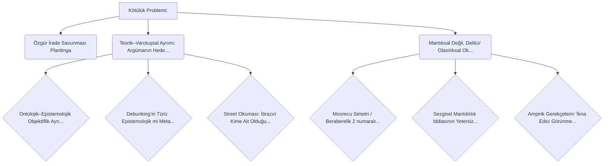

# Felsefi Argüman Haritası

## Görsel Özet

## Detaylı Akış

## 🌳 Kötülük Problemi: 
_ROOT_ | Score: 1.0

Felsefe tarihindeki en tartışmalı konulardan biri uzun zamandır din felsefesi literatüründe tartışılmaya devam edilen Kötülük Problemi’dir. Çağdaş din felsefesinde Plantinga ve Mackie arasındaki tartışmalarla daha da alevlenen
“Kötülük Problemi”
tartışmaları güncelliğini hala korumaktadır. Bu yazımızda Kötülük Problemi’nin genel bir şemasını çizmeye çalışacak; Plantinga’nın Özgür İrade Savunusu’na değinecek ve bu savunmayı eleştirmeye çalışacağız. Giriş
Din felsefesi alanında Tanrı’nın varlığı l...

### 🔴 Özgür İrade Savunması (Plantinga)
_OBJECTION_ | Score: 0.9

Plantinga’ya göre Tanrı’nın ahlaki açıdan anlamlı özgür iradeye sahip yaratıklar yaratması, onların kötülük yapma olasılığını da içerir; bu yüzden kötülüğün varlığı Tanrı’nın her şeye kadir, tümüyle iyi ve her şeyi bilen olmasıyla mantıksal bir çelişki oluşturmak zorunda değildir.

### 🔴 Teorik–Varoluşsal Ayrımı: Argümanın Hedefi Kayabilir (Taliaferro & Marty)
_OBJECTION_ | Score: 0.9

Taliaferro ve Marty’nin ayrımına göre kötülük problemi teorik (mantıksal/olasılıksal) ve varoluşsal biçimlerde ele alınır; bu, “kötülük problemi”nin her zaman Tanrı’nın varlığıyla mantıksal tutarsızlık gösteren tek bir argüman olmadığına, dolayısıyla argümanın kapsam ve iddiasının netleştirilmesi gerektiğine işaret eder.

#### 🟢 Ontolojik–Epistemolojik Objektiflik Ayrımı
_REBUTTAL_ | Score: 0.9

Metin, objektif ve bağlayıcı bir ahlak için ontolojik objektifliğin zorunlu olup olmadığının tartışmalı olduğunu söyler. Matematik analojisiyle, ontolojik varlık (nesnelerin gerçekten var olması) reddedilse bile doğruların/objektifliğin (epistemolojik objektiflik) savunulabileceği belirtilir; dolayısıyla argümanın hedefi (ontolojiye saldırı) varoluşsal düzeyde belirleyici olmayabilir.

#### 🟢 Debunking’in Türü: Epistemolojik mi Metafizik mi? (Das)
_REBUTTAL_ | Score: 0.9

Ramon Das’a atıfla, evrimci çürütme itirazlarının aslında epistemolojik değil metafiziksel olduğu iddia edilir. Bu, argümanın “inançlarımız gerekçesiz” sonucuna değil “ahlaki olgular yok” sonucuna kaydığını (hedef kayması) göstererek, epistemik çürütme iddiasını zayıflatır.

#### 🟢 Street Okuması: İtirazın Kime Ait Olduğu ve Ne Hedeflediği Belirsizleşebilir
_REBUTTAL_ | Score: 0.9

Metin, Street’in verdiği örneğin ‘evrim ile ahlaki yargılarımız arasında bağ yoktur’ görüşünü eleştirdiği kişilerin ağzından anlatıyor olabileceğini, yani bunun Street’in kendi tezi olmayabileceğini söyler. Bu yorum mümkün olduğundan, argümanın hedefinin (realistlere karşı epistemolojik itiraz mı, yoksa başka bir pozisyona yönelik mi) kayabileceği ve dolayısıyla eleştirinin yanlış hedefe yöneltilebileceği savunulur.

### 🔴 Mantıksal Değil, Delilci/ Olasılıksal Okuma (Taliaferro & Marty)
_OBJECTION_ | Score: 0.9

Metindeki ayrıma göre mantıksal versiyon ‘herhangi bir kötülük’ ile Tanrı’nın varlığının bağdaşamayacağını iddia ederken, olasılıksal (delilci) versiyon mevcut kötülüğün miktar/şiddetinden Tanrı’nın varlığının ‘pek mümkün olmadığı’ sonucunu çıkarır; bu da mantıksal çelişki iddiasının (Mackie/Epiküros çizgisi) daha zayıf bir hedef olabileceği eleştirisini doğurur.

#### 🟢 Moorecu Simetri / Beraberelik (2 numaralı argüman)
_REBUTTAL_ | Score: 0.9

Metne göre şüphecinin “1 numaralı argümanı” (simülasyon vb.) kadar mantıksal olarak zorlayıcı, simetrik bir “2 numaralı argüman” da kurulabilir. Bu beraberelik, şüphecinin sonucunu mantıksal olarak kabul etmek zorunda olmadığımızı gösterir ve şüpheciyi bir tür çıkmaza/berabereye iter.

#### 🟢 Sezgisel Mantıklılık İddiasının Yetersizliği (daha iyi gerekçelendirme talebi)
_REBUTTAL_ | Score: 0.9

Şüpheci, 1 numaralı öncülün “sezgisel olarak mantıklı” olduğunu söyleyerek delil ihtiyacını düşürmeye çalışabilir; ancak metinde Moore’un çizgisi, böyle bir ısrarın tek başına yeterli olmadığı ve 1 numaralı argümanın 2 numaralı argümandan daha iyi olduğuna karar vermeden önce daha iyi bir gerekçelendirme talep edilmesi gerektiğidir.

#### 🟢 Ampirik Gerekçelerin ‘İkna Edici Görünmesi’ (Moore’un 1* vurgusu)
_REBUTTAL_ | Score: 0.9

Metin, şüphecinin 1 numaralı öncül için sunduğu ampirik gerekçelerin “hakiki” olmayabileceğini; iyi gerekçeler gibi hissettirse de alttaki varsayımlar didiklenince güçlerini yitirebileceğini söyler (Moore’un 1*’ini destekleyen varsayım). Bu, delilci/olasılıksal okumanın dayandığı ampirik desteklerin güvenilirliğine yönelik bir savunmadır.
