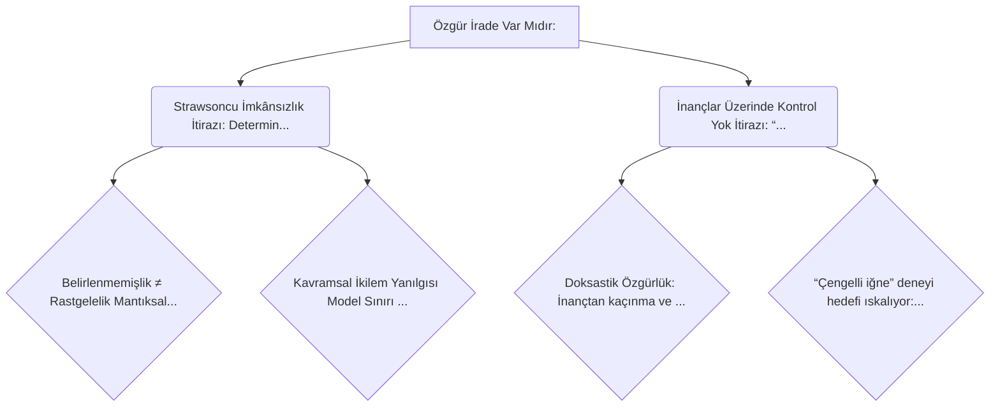

# Felsefi Argüman Haritası

## Görsel Özet

## Detaylı Akış

## 🌳 Özgür İrade Var Mıdır: 
_ROOT_ | Score: 1.0

Analitik Felsefe:Tümü
·
Metafizik
Doğası Gereği Özgür: Özgür İradenin Biyolojik Kökleri – Anne Sophie Meincke
İrademizin özgür olup olmadığı, kuşaklar boyu filozofların kafa yorduğu bir sorudur. Bu makalede, filozof Anne Sophie Meincke, özgür iradenin kafa karıştırıcı ikilemini ve biyolojinin bu sorunun çözümüne nasıl katkı sağlayabileceğini açıklıyor.

Özgür iradenin varlığı sorunu, düşünce tarihinin –henüz kesin bir çözüme kavuşmamış– en köklü problemlerinden biridir: “İnsanın özgür iradesi va...

### 🔴 Strawsoncu İmkânsızlık İtirazı: Determinizm yoksa rastgelelik var
_OBJECTION_ | Score: 0.9

Metinde, determinizmin doğru olmadığı varsayımında eylemlerin (parmağı oynatmak dahil) rastgele olacağı ve bunun da özgür iradeyi ortadan kaldıracağı söyleniyor; Galen Strawson da bu çizgide özgür iradenin var olmasının “muhtemelen imkansız” olduğunu savunuyor.

#### 🟢 Belirlenmemişlik ≠ Rastgelelik (Mantıksal Boşluk Savunması)
_REBUTTAL_ | Score: 0.9

Chomsky’nin işaret ettiği gibi, bir eylemin evrenin başlangıç koşulları ve doğa yasaları tarafından tam olarak belirlenmemiş olması onun zorunlu olarak rastgele olduğu anlamına gelmez. Determinizm ile rastgelelik arasında mantıksal bir boşluk vardır; özgür irade bu ikisinin dışında, bu boşlukta konumlanabilir.

#### 🟢 Kavramsal İkilem Yanılgısı (Model Sınırı Savunması)
_REBUTTAL_ | Score: 0.9

Chomsky’ye göre bilimsel/kavramsal modellerimiz eylemleri ya belirlenmiş ya da rastgele olarak yakalamaya eğilimlidir; özgür irade bunların ikisi de değilse, onu bu ikiliğe zorlamak hatalıdır. Bu durumda “determinizm yoksa rastgelelik var” itirazı, özgür iradeyi yanlış bir ikiliğe sıkıştıran bir çerçeve dayatması olur.

### 🔴 İnançlar Üzerinde Kontrol Yok İtirazı: “Yapmalı” epistemik anlamda çöker
_OBJECTION_ | Score: 0.9

İtiraz #4’e göre insanlar inançları üzerinde kontrole sahip değildir; bu yüzden “epistemik olarak irrasyonel bir inanca sahip olmamalı” denmesi, kişinin o inançtan kaçınabilme gücü olduğu anlamına gelmez. Çengelli iğne olduğunuza inanmayı deneyememeniz örneğiyle, inançların iradi kontrol altında olmadığı ileri sürülür.

#### 🟢 Doksastik Özgürlük: İnançtan kaçınma ve kabul etme mümkündür
_REBUTTAL_ | Score: 0.9

Metne göre insanlar seçimlerinde özgür oldukları gibi inançlarında da (en azından yeterince gerekçelendirilmemiş bir inancı kabul etmekten kaçınma düzeyinde) özgür olabilirler; aksi halde irrasyonel inançlar için eleştirinin nasıl mümkün olacağı açıklanamaz. Ayrıca delillerin kesin sonuca götürmediği durumlarda “iman sıçrayışı” ile bir önermeyi kabul etmeyi seçme ve iyi gerekçelendirilmiş bir önermeyi öz-kandırı yoluyla reddetme gibi olgular, inançlar üzerinde bir tür kontrol bulunduğuna ampirik dayanak sunar.

#### 🟢 “Çengelli iğne” deneyi hedefi ıskalıyor: Yanlış türden örnek
_REBUTTAL_ | Score: 0.9

Metindeki savunmaya göre “çengelli iğne olduğuna inanmayı dene” örneği, gerekçelendirilmemiş bir inancı benimsemekten kaçınamamanın değil, tersine reddi güçlü biçimde gerekçelendirilmiş (açıkça yanlış) bir önermeyi kabul edememenin örneğidir. Bu yüzden, ‘gerekçelendirilmemiş önermeleri kabul etmekten kaçınmalıyız’ şeklindeki epistemik “yapmalı”yı zayıflatmaz.
